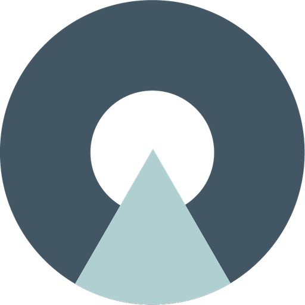

  <a href="https://oasis.art">
    
    <h3 align="center">OASIS</h3>
  </a>
  

 
 

# Getting Started with OASIS webapp

The OASIS webapp was bootstrapped with [Create React App](https://github.com/facebook/create-react-app).

## Running webapp locally

Once the [OASIS server](https://github.com/oasis-art-project/oasis-server) is up and running locally, you can following the next steps to setup and launch the webapp:

1. First, install all dependencies of the project:  
`yarn`  

2. Then start the webapp by running:  
`yarn start` 

3. If the start command fails with an error `Attempting to bind to HOST environment variable:...`, then run the following before starting it again:  
`unset HOST`  

4. If the steps above are succesful, then the webapp should be running locally in the development mode, and you can open [http://localhost:3000](http://localhost:3000) to view it in the browser. The page will reload if you make edits, and you will also see any lint errors in the console.

## Test running

You can launch the test runner in the interactive watch mode with:  
`yarn test`  
See the section about [running tests](https://create-react-app.dev/docs/running-tests/) for more information.

## Production building

In order to build the webapp for production to the `build` folder, run:  
`yarn build`  

It correctly bundles React in production mode and optimizes the build for the best performance. The build is minified and the filenames include the hashes. Your app is ready to be deployed!

See the section about [deployment](https://create-react-app.dev/docs/deployment/) for more information.
